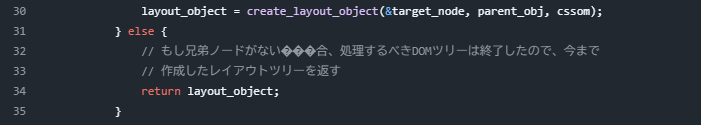
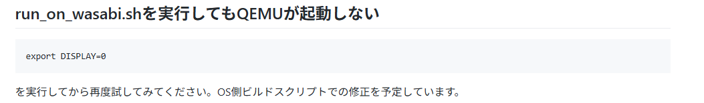
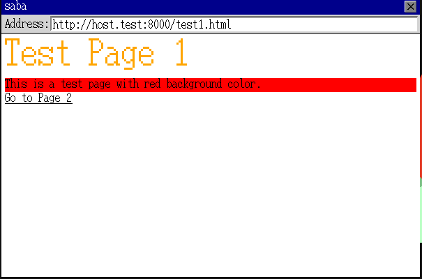
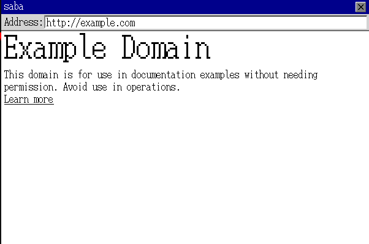
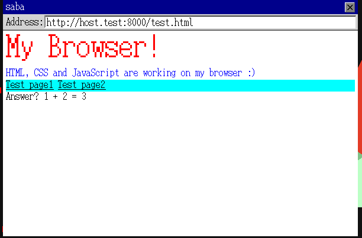

# 学習ログ：「作って学ぶ ブラウザのしくみ」

---

## 2026/02/15

第4章まで完了  
独自OS上で動かすのは面白い  
rustあんまりわからないから、書いててもよくわかってない  
html構造をパースして解析して動かしているのは分る  
テストコードを書いて動かすので、エラー箇所がわかるのはありがたい
最初、独自OSを動かすことができず、結構つまった  
また、rustのエラー内容や対応がわからなかった  
そのため、一回挫折した  
  
今はchatgptのおかげで、エラーの意味とか対応方法がわかるから  
挫折せずに進められる  
とりあえず、まだブラウザっぽい感じはしない  

---

## 2026/02/22

CssToken::Ident(ref _ident) => {  
上で、エラーがでた  
  
エラーメッセージは以下  

error: cannot explicitly borrow within an implicitly-borrowing pattern  
  --> src/renderer/css/cssom.rs:84:33  
   |  
84 |                 CssToken::Ident(ref _ident) => {  
   |                                 ^^^ explicit `ref` binding modifier not allowed when implicitly borrowing  
   |  
   = note: for more information, see <https://doc.rust-lang.org/reference/patterns.html#binding-modes>  
note: matching on a reference type with a non-reference pattern implicitly borrows the contents  
  --> src/renderer/css/cssom.rs:84:17  
   |  
84 |                 CssToken::Ident(ref _ident) => {  
   |                 ^^^^^^^^^^^^^^^^^^^^^^^^^^^ this non-reference pattern matches on a reference type `&_`  
help: remove the unnecessary binding modifier  
   |  
84 -                 CssToken::Ident(ref _ident) => {  
84 +                 CssToken::Ident(_ident) => {  
   |  
  
error: could not compile `saba_core` (lib test) due to 1 previous error  
  
CssToken::Ident(_ident) => {  
上のように修正した  

---

## 2026/02/23

sababook/ch5/saba/saba_core/src/renderer/layout/layout_view.rs at main · d0iasm/sababook  
Line：32 コメントが文字化けしてる  

Compiling saba_core v0.1.0 (/home/taka/work/prg/rust/saba/saba/saba_core)  
error: cannot explicitly borrow within an implicitly-borrowing pattern  
  --> src/renderer/dom/api.rs:46:24  
   |  
46 |         NodeKind::Text(ref s) => s.clone(),  
   |                        ^^^ explicit `ref` binding modifier not allowed when implicitly borrowing  
   |  
   = note: for more information, see <https://doc.rust-lang.org/reference/patterns.html#binding-modes>  
note: matching on a reference type with a non-reference pattern implicitly borrows the contents  
  --> src/renderer/dom/api.rs:46:9  
   |  
46 |         NodeKind::Text(ref s) => s.clone(),  
   |         ^^^^^^^^^^^^^^^^^^^^^ this non-reference pattern matches on a reference type `&_`  
help: remove the unnecessary binding modifier  
   |  
46 -         NodeKind::Text(ref s) => s.clone(),  
46 +         NodeKind::Text(s) => s.clone(),  
   |  
  
error: could not compile `saba_core` (lib test) due to 1 previous error  
  
上のエラーメッセージがでた  
NodeKind::Text(ref s) => s.clone(),  
を  
 NodeKind::Text(s) => s.clone(),  
に修正した  
  
---

## 2026/02/24

実際に書籍に記載されているプログラムと    
Github上のプログラムで差分がある気がする    
気のせいか？  

---

## 2026/02/28

「作って学ぶ ブラウザのしくみ」  
を読んでるけど、6章でつまった  
おそらくQEMUで作ったブラウザウィンドウが開かれるはずだが、ウィンドウが描画されない  
wsl上で動かしているので、環境が問題だと思うけど、解決方法がわからん  
  
サポートページに記載されているおまじないを試したけど動かない  
何が原因かよくわからん  
もうちょっと調べよう  

PC再起動でQUEMが立ち上がってきたが、ブラウザのwindowが立ち上がらない  
多分コードに問題があるっぽい  
  
[自作ブラウザ作業配信 - Windowsで自作ブラウザ本を試してみる会](https://www.youtube.com/watch?v=LxDTgMe1A6E)  
参考URL：https://www.youtube.com/watch?v=LxDTgMe1A6E&t=1665s  
  
上で、「saba」って文字列を入力してるのを、見て  
「saba」の入力を試したらwindowがでた  
わからんかった  
  
マウスカーソルを描画する  
で  
  
fn handle_mouse_input(  
    &mut self,  
    handle_url: fn(String) -> Result<HttpResponse, Error>,  
) -> Result<(), Error> {  
  
をサンプル通りに記載するとエラーが発生した  
  
handle_urlって何だろう？という感じのエラーだった  
引数には指定されているけど、呼び出し元では設定されていないようだった  
書籍にも特に説明が見当たらなかった  

GitHubのサンプルコードを参考にしてhandle_urlを追加していったところ、  
エラーは解消された  

もう少し補足があると分かりやすかったかもしれない  
ページ数の制約があるのは理解できるけど、  
どのファイルにどんな修正が必要かが分かると助かると感じた  

---

## 2026/03/04
  
裏でpython3でローカルサーバを動かす必要あり  
test1.htmlが上手く表示できた  
  

example.com を表示できた  
  
  
第6章まで完了  
  
---

## 2026/03/28

第7章まで終わったが、  
test.htmlが404になった  
理由がよくわからない   
なんで？  
example.comは表示できてる  
ローカルファイルが見れなくなったってことか？なんか、出力された  
なんでだろ、理由がよくわからない  
  
Test page1とTest page2への遷移もできた  
1+2=3も表示できている  
ばっちり  

 

---

## 本書の実装を通して得られた知見

ブラウザを作っているという感覚はあんまりなかった  
字句解析とか構文解析であったり、パースであったり  
そのような、処理構造を学習する分にはよいが  
（httpの通信であったりtlsであったりの説明はあるのだが）  
ネットワークの処理についての学習には向いていないと感じた  
（それが良い悪いではなく、方向性が違うということ）  
  
ブラウザがどのように、html文章を解析しているのかを学ぶものである  
という意味が強いし  
実際、本書にそういうことを書いている  
  
ただ、独自OS上で動かすため、OSの知識部分が必要そう  
環境構築あたりで、1度、挫折したので。。。。  
  
あとRust全然わからんマジ初心者だったので、  
エラー内容が分からず結構しんどかった  
（その都度、ChatGPTに聞いてエラー対応して、色々聞いたのでいい時代になった）  
Rust知識も必要だけど、今だとAIの手助けがあるのでありがたい  
  
今度は独自OSについても、学習していきたい  
